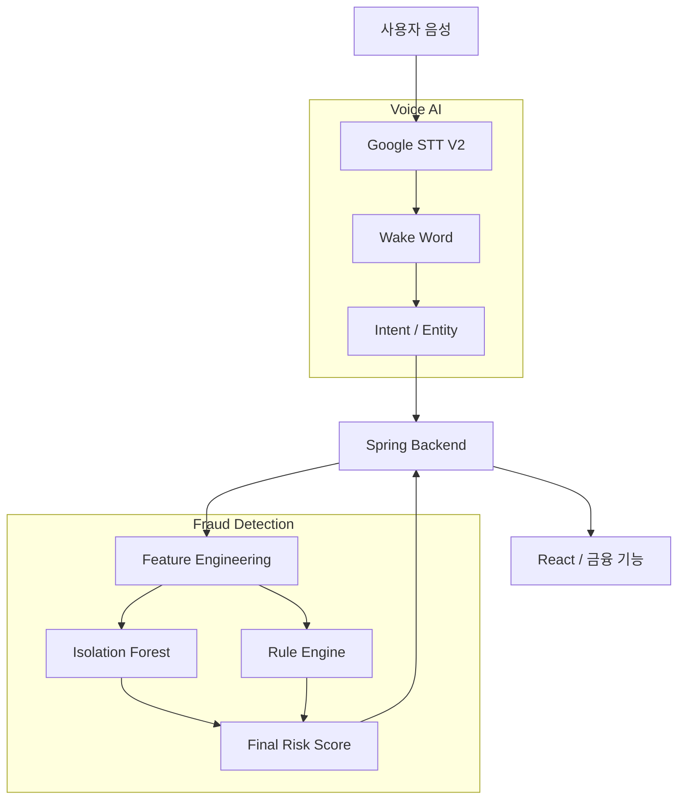
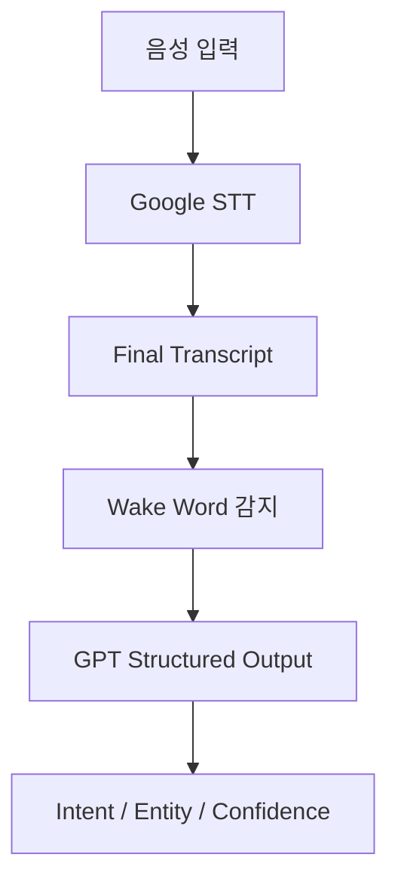
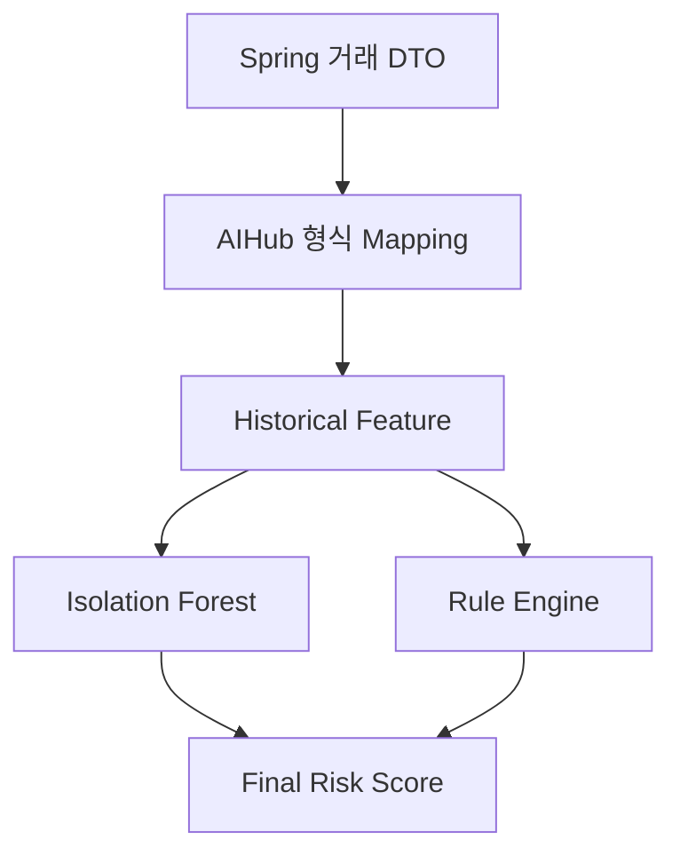

# MOVI AI

> 음성 금융 명령 분석과 이상거래 탐지를 담당하는 MOVI의 Python AI 서비스

MOVI AI는 사용자의 음성을 금융 서비스에서 사용할 수 있는 구조화 데이터로 변환하고,
이체 실행 전 현재 거래와 과거 거래 이력을 분석하여 위험 점수와 근거를 반환한다.

핵심 구성은 다음 두 가지다.

| 영역 | 역할 | 주요 기술 |
|---|---|---|
| Voice AI | 음성 인식, 호출어 감지, Intent 분류, Entity 추출 | Google STT V2, OpenAI Structured Output |
| Fraud Detection System | 사용자 거래 패턴 기반 이상도와 규칙 기반 위험도 결합 | Isolation Forest, Rule Engine, FastAPI |

---

## 1. 현재 구현 상태

| 구분 | 상태 | 비고 |
|---|:---:|---|
| Google STT V2 스트리밍 | ✅ | Interim/Final transcript 처리 |
| Wake Word `모비야` | ✅ | 호출어 없는 일반 대화 차단 |
| GPT Intent·Entity 분석 | ✅ | 실제 `gpt-5-nano` 호출 검증 |
| Voice Follow-up 분석 | ✅ | Backend가 지정한 필드만 갱신 |
| Google TTS 모듈 | ✅ | 텍스트→MP3 변환, Backend 응답 연결은 선택 과제 |
| Voice REST API | ✅ | 텍스트 분석 및 음성 파일 분석 경로 |
| Voice WebSocket | ✅ | PCM16 스트리밍 및 분석 이벤트 반환 |
| Isolation Forest | ✅ | 전자금융공동망 데이터 기반 |
| Historical Feature | ✅ | 사용자 과거 거래 패턴 반영 |
| Rule Engine | ✅ | 8개 설명 가능한 규칙 |
| Final Risk Score | ✅ | Model 40% + Rule 60% |
| FDS API | ✅ | 모델·규칙·점수를 단일 서비스에서 실행 |
| 입력 검증·안전한 오류 응답 | ✅ | 내부 예외와 민감 입력 비노출 |
| 자동·시나리오 검증 | ✅ | 59개 검증 항목 통과 |
| 실제 GPT 스모크 테스트 | ✅ | 핵심 명령 4개 통과 |
| 마이크→STT→GPT 통합 테스트 | ⏭️ | 마이크 없는 장비에서 보류 |

---

## 2. 전체 아키텍처



### 역할 분리

| Python AI | Spring Backend |
|---|---|
| Google STT 및 transcript 생성 | 사용자 인증과 세션 소유권 관리 |
| Wake Word 감지 | 필수 필드와 누락 필드 최종 판단 |
| Intent 및 Entity 추출 | 추가 질문과 `requested_field` 결정 |
| Entity confidence 산출 | 사용자·계좌·적금·거래내역 DB 조회 |
| Isolation Forest 추론 | 출금 계좌 및 수취 계좌 확정 |
| Rule Engine 및 위험 점수 계산 | 실제 금융 기능 실행·보류·차단 |

GPT가 반환하는 `missing_fields`는 이전 코드와의 호환을 위해 항상 빈 배열로 유지한다.
말하지 않은 Entity는 추측하지 않고 `null`로 반환하며, 필수값과 다음 질문은 Spring이
사용자 DB와 현재 화면 상태를 바탕으로 최종 결정한다.

실시간 오디오에서는 Scope A 일정에 맞춰 Spring의 바이너리 WebSocket 릴레이를 두지
않는다. Python Voice API가 직접 스트림을 처리하고, Spring은 구조화된 명령과 금융
비즈니스 상태를 관리한다.

---

## 3. 기술 스택

| 구분 | 기술 |
|---|---|
| Language | Python 3.11 |
| API | FastAPI, Uvicorn |
| STT | Google Cloud Speech-to-Text V2 |
| NLU | OpenAI `gpt-5-nano`, Pydantic Structured Output |
| Model | scikit-learn Isolation Forest |
| Data | Pandas, NumPy, SciPy Sparse Matrix |
| Preprocessing | SimpleImputer, OneHotEncoder |
| Model Artifact | Joblib, JSON threshold |
| Dataset | AIHub 금융 이상거래 데이터 |
| Test | unittest, FastAPI TestClient, 실제 API 스모크 테스트 |

---

## 4. 핵심 프로젝트 구조

```text
MOVI/
├── data/
│   ├── Train/
│   └── Validation/
├── models/
│   └── electronic/
│       ├── isolation_forest.joblib
│       └── threshold.json
├── reports/
│   └── electronic_metrics.json
├── src/
│   ├── fraud_detection/
│   │   ├── config.py
│   │   ├── data_loader.py
│   │   ├── feature_engineering.py
│   │   ├── train_iforest.py
│   │   ├── evaluate.py
│   │   ├── schemas.py
│   │   ├── transaction_mapper.py
│   │   ├── fraud_service.py
│   │   ├── rule_engine.py
│   │   ├── risk_score.py
│   │   ├── api.py
│   │   ├── inference.py
│   │   ├── inference_service.py
│   │   └── backend_client.py
│   └── voice_analysis/
│       ├── config.py
│       ├── schemas.py
│       ├── api_schemas.py
│       ├── contract_schemas.py
│       ├── contract_mapper.py
│       ├── stt_batch_service.py
│       ├── stt_stream_service.py
│       ├── stream_session.py
│       ├── wake_word_detector.py
│       ├── requirement_analyzer.py
│       ├── requirement_validator.py
│       ├── conversation_context.py
│       ├── follow_up_entity_parser.py
│       ├── voice_service.py
│       ├── api.py
│       ├── request_mapper.py
│       ├── tts_service.py
│       ├── voice_pipeline.py
│       └── backend_client.py
└── tests/
    ├── test_rule_engine.py
    ├── test_risk_score.py
    ├── test_risk_scenarios.py
    ├── test_fraud_service.py
    ├── test_fraud_api_errors.py
    ├── test_voice_service.py
    ├── test_voice_api.py
    ├── live_voice_smoke.py
    └── live_stt_voice_smoke.py
```

### 공식 서비스 경로

- FDS 추론의 공식 진입점은 `FraudDetectionService`다.
- Voice 텍스트 분석의 공식 진입점은 `VoiceAnalysisService`다.
- `api.py`는 HTTP/WebSocket 전달과 안전한 오류 변환만 담당한다.
- `voice_pipeline.py`, 각 영역의 `backend_client.py`, 기존 `inference.py` 계열은
  이전 통합 실험 또는 오프라인 실행 호환을 위해 유지한다.

---

# Voice AI

## 5. 음성 처리 흐름



### 지원 입력 방식

| 방식 | 입력 | 용도 |
|---|---|---|
| 텍스트 REST | 확정 transcript | Voice 로직 및 Backend 연동 테스트 |
| 음성 파일 REST | WebM/Opus 또는 WAV multipart | Spring 내부 계약 경로 |
| WebSocket | PCM16, 16kHz, mono chunk | 실시간 Interim/Final transcript |

Requirement 분석에는 STT의 `final` 결과만 사용한다. WebSocket에서는
`interim`, `final`, `analysis`, `error` 이벤트를 구분하여 반환한다.

---

## 6. Wake Word

호출어는 `모비야`이며 STT 띄어쓰기 차이를 고려해 `모비 야`도 허용한다.

```text
모비야 김민수에게 오만원 보내줘
        ↓
김민수에게 오만원 보내줘
```

| 입력 상태 | 결과 상태 |
|---|---|
| 호출어 없음 | `ignored` |
| 호출어만 존재 | `awaiting_command` |
| 호출어 + 지원 명령 | `analyzed` |
| 호출어 + 미지원 명령 | `unsupported` |

---

## 7. Intent와 Entity

### Intent

| 사용자 기능 | 내부 Intent |
|---|---|
| 현재 화면 읽기 | `read_screen` |
| 계좌 이체·송금 | `transfer_money` |
| 거래내역 조회 | `check_history` |
| 계좌 잔액 조회 | `check_balance` |
| 가입 적금 조회 | `check_savings` |
| 요청 승인 | `confirm` |
| 요청 부정 | `deny` |
| 작업 취소 | `cancel` |
| 지원하지 않는 요청 | `unknown` |

### Entity

| 기능 | Entity |
|---|---|
| 송금 | `recipient_name`, `recipient_bank`, `recipient_account`, `amount` |
| 출금 계좌 | `source_bank`, `source_account` |
| 거래내역·잔액 조회 | `date_from`, `date_to`, `bank`, `account` |

금액은 원 단위 정수로 변환한다.

```text
오만원     → 50000
십만원     → 100000
백이십만원 → 1200000
```

사용자가 말하지 않은 이름·은행·계좌번호·금액은 생성하지 않는다. 등록된 수취인이나
사용자 보유 계좌를 찾는 작업은 Backend가 담당한다.

### Confidence

- `intent_confidence`: Intent 분류 확신도 `0.0~1.0`
- `entity_confidences`: 실제로 추출한 Entity별 확신도 `0.0~1.0`
- 값이 `null`인 Entity에는 confidence도 채우지 않는다.
- Backend는 낮은 confidence를 사용자 재확인 조건으로 활용할 수 있다.

---

## 8. Follow-up 분석

Spring이 추가로 필요한 필드를 지정하면 Python은 그 필드만 분석한다.

```text
Spring: requested_field = recipient_bank
사용자: "국민은행이야"
Python: recipient_bank = "국민은행"
```

지원 필드:

```text
recipient_name
recipient_bank
recipient_account
amount
```

파싱 성공 시 기존 Entity 복사본에서 요청받은 값만 갱신한다. 실패하면 기존 Entity를
변경하지 않고 `parse_failed`를 반환한다. 대화 상태와 `request_id`의 소유자는 Spring이다.

---

## 9. Voice API

### Endpoint

| Method | Path | 설명 |
|---|---|---|
| GET | `/` | 서비스 기본 정보 |
| GET | `/health` | 프로세스와 분석기 상태 |
| GET | `/ready` | 요청 처리 가능 여부 |
| POST | `/api/v1/voice/analyze` | STT 확정 문장 분석 |
| POST | `/api/v1/voice/follow-up` | 추가 Entity 분석 |
| POST | `/internal/v1/voice/analyze` | 음성 파일 기반 Backend 계약 경로 |
| WS | `/internal/v1/voice/stream` | 실시간 PCM 스트리밍 |

### 텍스트 분석 요청

```json
{
  "transcript": "모비야 김민수에게 오만원 보내줘"
}
```

### 텍스트 분석 응답

```json
{
  "status": "analyzed",
  "intent": "transfer_money",
  "transcript": "김민수에게 오만원 보내줘",
  "entities": {
    "recipient_name": "김민수",
    "recipient_bank": null,
    "recipient_account": null,
    "amount": 50000,
    "source_bank": null,
    "source_account": null,
    "date_from": null,
    "date_to": null,
    "bank": null,
    "account": null
  },
  "message": null
}
```

### Follow-up 요청

```json
{
  "transcript": "국민은행이야",
  "requested_field": "recipient_bank",
  "entities": {
    "recipient_name": "김민수",
    "recipient_bank": null,
    "amount": 50000
  }
}
```

### 음성 파일 계약 경로

`/internal/v1/voice/analyze`는 다음 multipart 필드를 받는다.

| 필드 | 타입 | 설명 |
|---|---|---|
| `audio` | file | WebM/Opus 또는 WAV, 최대 5MB |
| `requestId` | string | Backend 요청 식별자 |
| `voiceSessionId` | integer | 음성 세션 식별자 |
| `expectedIntent` | string, optional | 진행 중인 Intent |
| `expectedSlots` | JSON string, optional | Backend가 요청한 슬롯 목록 |

응답은 Backend 계약에 맞춰 `requestId`, `voiceSessionId`, `transcript`,
`sttConfidence`, `intent`, `intentConfidence`, `entities`,
`entityConfidences`, `detectedMissingEntities`, `processingMs`를 반환한다.

`detectedMissingEntities`는 계약 응답용 분석 힌트이며, 금융 기능 실행에 필요한 필드의
최종 판정은 Spring이 담당한다.

### WebSocket 메시지

클라이언트는 PCM16/16kHz/mono 바이너리 chunk를 보내고 스트림 종료 시 `EOS`를 보낸다.

서버 메시지:

```text
interim  → 인식 중인 문장
final    → 확정 문장, 호출어 여부, 실제 command
analysis → Intent/Entity 분석 결과
error    → 오류 코드와 재시도 가능 여부
```

`EOS`까지 정상 수신했지만 STT가 `final`을 만들지 못하면 중간 인식으로 금융 명령을
실행하지 않고 `NO_FINAL_RESULT` 오류를 반환한다. 이 오류는 재시도할 수 있다.

---

## 10. Voice 오류 처리

| 상황 | HTTP 상태·코드 |
|---|---|
| 분석기 미준비 | `503 VOICE_ANALYZER_NOT_READY` |
| OpenAI 연결·시간초과·Rate Limit | `503 VOICE_ANALYZER_UNAVAILABLE` |
| 잘못된 텍스트·Follow-up 요청 | `400 INVALID_VOICE_REQUEST` 또는 `400 INVALID_FOLLOW_UP_REQUEST` |
| 예상하지 못한 분석 오류 | `500 VOICE_ANALYSIS_FAILED` |
| 예상하지 못한 Follow-up 오류 | `500 VOICE_FOLLOW_UP_FAILED` |

입력 transcript, 계좌정보, 내부 예외 메시지와 서버 경로를 외부 오류 응답에 그대로
노출하지 않는다.

### TTS

`tts_service.py`는 Google Cloud Text-to-Speech를 이용해 Backend가 만든 안내 문장을
MP3 bytes 또는 파일로 변환한다. 현재 핵심 Voice API의 필수 응답에는 포함하지 않으며,
사용자 확인 문구와 조회 결과를 음성으로 출력하는 단계에서 선택적으로 연결한다.

---

# Fraud Detection System

## 11. FDS 처리 흐름



FDS는 전체 데이터에서 드문 거래만 찾는 것이 아니라, 현재 거래가 해당 출금계좌의
과거 행동과 비교해 얼마나 이례적인지를 판단한다.

---

## 12. 데이터와 Feature Engineering

AIHub 금융 이상거래 데이터 중 전자금융공동망 데이터를 우선 사용했다.

Validation 데이터:

| 구분 | 건수 |
|---|---:|
| 전체 | 492,678 |
| 정상 | 490,770 |
| 이상 | 1,908 |

미래 거래가 현재 Feature에 포함되지 않도록 거래일자와 거래시간대를 기준으로
정렬하고, 현재 거래 이전 이력만 통계에 사용한다.

### 사용 Feature

| 분류 | Feature | 의미 |
|---|---|---|
| 금액 | `log_amount` | 로그 변환 거래금액 |
| 금액 | `amount_ratio` | 현재 금액 / 과거 평균 금액 |
| 금액 | `amount_zscore` | 과거 금액 분포 기준 Z-score |
| 시간 | `hour_sin`, `hour_cos` | 시간의 순환형 인코딩 |
| 시간 | `is_night` | 심야 거래 여부 |
| 날짜 | `weekday`, `is_weekend` | 요일·주말 여부 |
| 은행 | `same_bank` | 출금·입금 금융기관 동일 여부 |
| 상대 | `new_recipient` | 처음 거래한 수취인 여부 |
| 매체 | `unusual_medium` | 과거 사용하지 않은 거래 매체 |
| 빈도 | `historical_transaction_count` | 이전 누적 거래 수 |
| 빈도 | `same_day_transaction_count` | 같은 날의 이전 거래 수 |
| 빈도 | `same_time_bucket_count` | 같은 날짜·시간대의 이전 거래 수 |

### 전처리

- 숫자형 결측값: `SimpleImputer(strategy="median")`
- 범주형 값: `OneHotEncoder(handle_unknown="ignore")`
- 추론: 학습 시 저장한 Preprocessor의 `transform()`만 사용
- 메모리: Sparse Matrix와 `float32` 사용
- Target 관련 컬럼은 Feature에서 제외하여 leakage 방지

첫 거래처럼 과거 이력이 없어서 `amount_ratio`나 `amount_zscore`가 `NaN`인 경우는
정상 입력이며 학습 데이터 기준 중앙값으로 처리한다.

---

## 13. Isolation Forest

정상 거래 패턴을 학습하고 다음과 같이 위험 방향을 직관적으로 변환한다.

```python
anomaly_score = -model.score_samples(X)
```

따라서 `anomaly_score`가 클수록 이상거래 위험이 높다.

모델과 전처리기는 하나의 Bundle로 저장한다.

```text
models/electronic/isolation_forest.joblib
models/electronic/threshold.json
```

Bundle에는 모델, Preprocessor, Dataset 유형, Feature 이름, 학습 점수 요약과 환경
정보가 포함된다.

### Baseline 성능

Threshold: `0.446117`

| Metric | 결과 |
|---|---:|
| Precision | 0.0926 |
| Recall | 0.1981 |
| F1 | 0.1262 |
| Average Precision | 0.0581 |
| PR-AUC | 0.0579 |
| ROC-AUC | 0.8848 |
| False Positive Rate | 0.00755 |
| False Negative Rate | 0.80189 |

| 구분 | 평균 Anomaly Score |
|---|---:|
| 정상 거래 | 0.3737 |
| 이상 거래 | 0.4176 |

ROC-AUC 기준 순위화 능력은 유효하지만 Recall이 낮으므로 Isolation Forest를 단독
차단기로 사용하지 않는다. 모델은 정상 패턴에서 벗어난 정도를 제공하고, 명시적인
위험 패턴은 Rule Engine이 보완한다.

---

## 14. Rule Engine

| Rule | 조건 | 점수 |
|---|---|---:|
| `HIGH_AMOUNT_RATIO` | 평소 금액의 5배 이상 | +25 |
| `EXTREME_AMOUNT_ZSCORE` | Z-score 절댓값 5 이상 | +20 |
| `NIGHT_TRANSACTION` | 심야 거래 | +15 |
| `NEW_RECIPIENT` | 신규 수취인 | +15 |
| `UNUSUAL_MEDIUM` | 신규 거래 매체 | +15 |
| `CROSS_BANK` | 타행 거래 | +5 |
| `REPEATED_SAME_DAY` | 같은 날 이전 거래 3건 이상 | +10 |
| `REPEATED_TIME_BUCKET` | 동일 시간대 이전 거래 2건 이상 | +10 |

Rule Score는 `0~100`으로 제한한다. 숫자 Feature가 누락되거나 문자열, `NaN`, 무한대
등 잘못된 값이면 안전한 기본값을 사용한다.

Rule 임계값과 점수는 `config.py`의 `RULE_CONFIG`에서 중앙 관리한다.

---

## 15. Final Risk Score

Isolation Forest 점수는 Validation 분포를 기준으로 `0~100`에 Piecewise Linear
Mapping한다.

| Anomaly Score | Model Risk Score |
|---:|---:|
| 0.373701 | 0 |
| 0.419761 | 40 |
| 0.446117 | 70 |
| 0.472755 | 90 |
| 0.528859 | 100 |

최종 정책:

```text
Final Risk Score = Model Risk × 0.40 + Rule Score × 0.60
```

| Final Risk Score | Level |
|---:|---|
| `0 ≤ score < 40` | `LOW` |
| `40 ≤ score < 70` | `MEDIUM` |
| `70 ≤ score ≤ 100` | `HIGH` |

모델 기준점, 가중치, 등급 경계는 `config.py`에서 관리하며 서버 시작 시 정책값의
정합성을 검증한다.

---

## 16. FraudDetectionService

FDS의 공식 서비스 계층은 다음 작업을 한 번에 수행한다.

```text
DTO 검증
→ AIHub 형식 Mapping
→ Historical Feature Engineering
→ 저장 Preprocessor 변환
→ Isolation Forest 추론
→ Rule Engine
→ Final Risk Score
```

API와 추론 로직을 분리했기 때문에 FastAPI 없이도 서비스를 단위 테스트할 수 있다.

추가 안전 처리:

- 모델 파일이 없어도 서버와 `/health`는 기동
- 모델·Preprocessor·Threshold가 모두 준비된 경우에만 `/ready` 성공
- 현재 거래와 History의 `transaction_id` 중복 차단
- 잘못된 금액·시간·요청 구조는 Pydantic과 서비스에서 검증
- 원본 거래 DataFrame 및 계좌정보 전체를 로그에 출력하지 않음
- 내부 예외 상세를 API 응답에서 숨김

---

## 17. FDS API

### Endpoint

| Method | Path | 설명 |
|---|---|---|
| GET | `/` | 서비스 정보와 구성요소 |
| GET | `/health` | 프로세스 및 모델 로딩 상태 |
| GET | `/ready` | 실제 추론 가능 여부 |
| POST | `/api/v1/fraud/detect` | 현재 거래 위험도 분석 |

### 요청

```json
{
  "current_transaction": {
    "transaction_id": "tx-current",
    "sender_account": "100001",
    "receiver_account": "999999",
    "sender_bank": "KB",
    "receiver_bank": "SH",
    "transaction_type": "transfer",
    "amount": 10000000,
    "transaction_datetime": "2026-08-26T00:30:00",
    "medium": "WEB"
  },
  "history": [
    {
      "transaction_id": "tx-history-1",
      "sender_account": "100001",
      "receiver_account": "200001",
      "sender_bank": "KB",
      "receiver_bank": "KB",
      "transaction_type": "transfer",
      "amount": 50000,
      "transaction_datetime": "2026-08-20T15:30:00",
      "medium": "MOBILE"
    }
  ]
}
```

`history`에는 현재 거래 이전에 발생한 동일 출금계좌의 거래 이력을 전달한다.

### 응답

```json
{
  "transaction_id": "tx-current",
  "anomaly_score": 0.443008,
  "threshold": 0.446117,
  "is_anomaly": false,
  "model": "isolation_forest",
  "rule_score": 95.0,
  "final_risk_score": 83.58,
  "risk_level": "HIGH",
  "triggered_rules": [
    "HIGH_AMOUNT_RATIO",
    "EXTREME_AMOUNT_ZSCORE",
    "NIGHT_TRANSACTION",
    "NEW_RECIPIENT",
    "UNUSUAL_MEDIUM",
    "CROSS_BANK"
  ]
}
```

이 사례는 Isolation Forest 단독으로는 Threshold 직전의 정상 영역이지만, Rule Engine이
복합 위험 신호를 포착하여 최종 `HIGH`로 보완한 경우다.

### 오류 응답

| 상황 | HTTP 상태·코드 |
|---|---|
| 거래 요청 오류·중복 ID | `400 INVALID_TRANSACTION_REQUEST` |
| 모델·Threshold 미준비 | `503 MODEL_NOT_READY` |
| 서비스 내부 오류 | `500 INTERNAL_FDS_ERROR` |
| Pydantic Schema 오류 | `422` |

---

## 18. 5단계 위험 시나리오 결과

| 단계 | 조건 | Anomaly | Rule | Final | Level |
|---:|---|---:|---:|---:|---|
| 1 | 평소와 같은 거래 | 0.393392 | 0 | 6.84 | `LOW` |
| 2 | 고액 거래 | 0.440166 | 45 | 52.29 | `MEDIUM` |
| 3 | 고액 + 신규 수취인 | 0.432205 | 60 | 57.67 | `MEDIUM` |
| 4 | 고액 + 신규 수취인 + 심야 + 신규 매체 | 0.476542 | 90 | 90.27 | `HIGH` |
| 5 | 4단계 + 당일·동일 시간대 반복 | 0.484339 | 100 | 96.83 | `HIGH` |

검증 결과:

- 5개 API 응답 Schema 정상
- 단계별 예상 Rule 발생
- 위험 조건 증가에 따라 Rule Score 증가
- Final Risk Score와 Risk Level 역행 없음
- 모든 점수가 `0~100` 범위

---

# 실행 및 검증

## 19. 환경변수

프로젝트 루트의 `.env` 또는 실행 환경에 다음 값을 설정한다.

```dotenv
OPENAI_API_KEY=...
OPENAI_MODEL=gpt-5-nano

GOOGLE_CLOUD_PROJECT=...
GOOGLE_APPLICATION_CREDENTIALS=/absolute/path/service-account.json
GOOGLE_STT_LOCATION=us
GOOGLE_STT_MODEL=chirp_3

FDS_MODEL_PATH=models/electronic/isolation_forest.joblib
FDS_THRESHOLD_PATH=models/electronic/threshold.json
```

실제 변수명과 기본값은 각 영역의 `config.py`를 기준으로 한다.

셸에 예전 OpenAI 키가 남아 있으면 `.env`보다 우선 적용될 수 있다. 키를 교체한 뒤
401 오류가 발생하면 현재 셸 값을 제거하고 다시 실행한다.

```bash
unset OPENAI_API_KEY
```

---

## 20. 서버 실행

### FDS API

```bash
uvicorn src.fraud_detection.api:app --reload --port 8000
```

```text
Swagger: http://127.0.0.1:8000/docs
Health : http://127.0.0.1:8000/health
Ready  : http://127.0.0.1:8000/ready
```

### Voice API

```bash
uvicorn src.voice_analysis.api:app --reload --port 8001
```

```text
Swagger: http://127.0.0.1:8001/docs
Health : http://127.0.0.1:8001/health
Ready  : http://127.0.0.1:8001/ready
```

---

## 21. 테스트

### 검증 현황

| 테스트 | 항목 수 | 결과 |
|---|---:|:---:|
| Rule Engine 단위·경계 | 12 | ✅ |
| Risk Score 단위·경계 | 9 | ✅ |
| FDS 5단계 시나리오 | 5 | ✅ |
| FraudDetectionService | 5 | ✅ |
| FDS API 입력·오류 | 12 | ✅ |
| VoiceAnalysisService | 7 | ✅ |
| Voice API 입력·오류 | 9 | ✅ |
| 실제 GPT 핵심 명령 | 4 | ✅ |
| 마이크→STT→GPT | 4 | 장치 문제로 보류 |

자동·시나리오 검증 59개와 실제 GPT 검증 4개를 합쳐 **총 63개 검증 항목을
통과**했다.

### 자동 테스트

```bash
python tests/test_rule_engine.py
python tests/test_risk_score.py
python tests/test_fraud_service.py
python tests/test_fraud_api_errors.py
python tests/test_voice_service.py
python tests/test_voice_api.py
```

FDS 서버가 실행된 상태에서:

```bash
python tests/test_risk_scenarios.py
```

### 실제 GPT 테스트

```bash
python tests/live_voice_smoke.py
```

검증 명령:

```text
모비야 화면 읽어줘
모비야 김민수에게 국민은행 1234567890 계좌로 오만원 보내줘
모비야 거래내역 알려줘
모비야 가입한 적금 알려줘
```

실제 결과:

```text
검증 성공: 4개 실제 GPT 시나리오 통과
```

### 실제 마이크 통합 테스트

```bash
python tests/live_stt_voice_smoke.py
```

마이크가 없는 Mac mini에서는 `PortAudioError`로 보류했다. 이는 Intent, GPT 또는
Google 인증 실패가 아니라 로컬 입력 장치 문제다. 마이크가 있는 시연 장비에서 최종
확인한다.

---

## 22. 보안 및 저장소 규칙

다음 항목은 Git에 커밋하지 않는다.

```gitignore
.env
.env.*
!.env.example
.venv/
__pycache__/
*.py[cod]
.DS_Store
google-cloud-sdk/
Archive.zip
```

- OpenAI API Key와 Google 서비스 계정 JSON을 코드·Swagger 예시·로그에 기록하지 않는다.
- Google 인증 JSON은 프로젝트 외부에 두고 절대 경로만 환경변수로 전달한다.
- `.env`가 Git에 올라간 적이 있다면 포함된 실제 키를 폐기하고 재발급한다.
- `Archive.zip`, 가상환경, SDK 설치본, Python cache는 소스 코드가 아니다.
- 거래 원본 DataFrame과 전체 계좌정보를 로그에 출력하지 않는다.

---

## 23. 현재 한계와 후속 작업

### 필수 구현 완료

현재 Scope A 기준으로 Voice AI, FDS, API, 예외 처리, 핵심 테스트와 Git 반영까지
완료했다.

### 최종 통합 확인

| 우선순위 | 작업 | 완료 기준 |
|---|---|---|
| P0 | 팀 통합환경 Voice 호출 | Spring 요청에 Voice 응답 정상 반환 |
| P0 | 팀 통합환경 FDS 호출 | 실제 거래·History 요청에 위험도 정상 반환 |
| P0 | 마이크 장비 통합 테스트 | STT→GPT 핵심 음성 4개 통과 |
| P1 | 대표 시연 케이스 점검 | 정상 `LOW`, 복합 위험 `HIGH` 확인 |

### 선택적 고도화

- Train History와 Validation History 연결
- `amount_ratio`, `amount_zscore` Clip 또는 Robust 처리 비교
- Validation 기반 Rule·Model 가중치 재보정
- LOF 또는 Autoencoder 후보 모델 비교
- 카드거래 모델 확장
- TTS 및 음성 확인 UX 고도화

위 항목은 현재 필수 범위의 완료 조건에는 포함하지 않는다.

---

## 24. 핵심 설계 요약

```text
Voice AI
음성을 이해하고 구조화한다.
말하지 않은 금융정보는 추측하지 않는다.

Spring Backend
사용자·계좌 상태를 조회하고 필수값과 다음 질문을 결정한다.
실제 금융 기능의 실행 여부를 책임진다.

Fraud Detection
Isolation Forest로 사용자 패턴 이탈을 측정하고,
Rule Engine으로 설명 가능한 위험 신호를 보완한다.

Final Risk Score
Model 40% + Rule 60%를 결합하여 LOW/MEDIUM/HIGH를 반환한다.
```

MOVI AI는 언어 이해, 이상거래 추론, 금융 비즈니스 로직의 책임을 분리하여 각 파트가
독립적으로 개발·검증하면서도 명확한 API 계약으로 통합할 수 있도록 설계했다.
